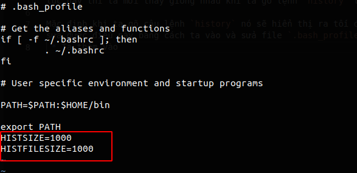

# History

Câu lệnh `history` chi phép hiển thị những câu lệnh đã được sử dụng. Khi bạn đứng ở user nào và bạn gõ câu lệnh `history` thì sẽ hiển thị ra những câu lệnh user đó đã từng sử dụng.

Có một cách khác để ta xem lịch sử các câu lệnh này ta có thể đọc trong file `.bash_history`. Mỗi user có một file `.bash_history` của riêng mình.

Có một chú ý rằng khi ta đăng nhập vào cùng 1 user nhưng trên các terminal khác nhau khi thực hiện các lệnh khác nhau và ta xem history thì ta sẽ thấy có sự khác nhau. Ta sẽ không thấy nó hiện những lệnh ta vừa thực hiện ở những terminal khác. Khi nào chúng ta kết thúc phiên làm việc vơí user thì tất cả các lệnh chúng ta thực hiện mới được lưu vào file `.bash_history` và lúc này thì ta mới thấy giống nhau khi ta gõ lệnh `history` trên các terminal khác nhau.

Mặc định khi ta gõ câu lệnh `history` nó sẽ hiển thị ra tối đa là 1000 câu lệnh. Ta có thể sửa được điều này bằng cách ta vào và sửa file `.bash_profile` .Ta thêm vào đó 2 dòng lệnh `HISTSIZE=1000` và `HISTFILESIZE=1000`

Trong đó:

- `HISTSIZE` là ta giới hạn số câu lệnh tối đa hiển thị lên màn hình khi ta dùng lệnh `history`
- `HISTFILESIZE` là giới hạn số câu lệnh được lưu vào trong file `.bash_history`
- Số `1000` ở trên bạn có thể thay đổi tùy ý.

### Một số option với câu lệnh `history`

- `history x` nó sẽ hiển thị ra `x` câu lệnh gần nhất bạn nhập vào.

- `history -c` để xóa tất cả các lịch sử các câu lệnh đã nhập.
- Khi ta dùng lệnh `history` ta sẽ biết số thứ tự của câu lệnh đó. Để thực hiện lại lệnh đó thay vì gõ lại lệnh ta nhập vào `!X` trong đó `x` là STT.

- Để tìm kiếm một lệnh đã thực hiện mà ta không nhớ rõ về lệnh đó ta thực hiện nhấn `Ctrl` `R` sau đó nhập vào một vài chữ cái liên quan nó sẽ hiện lệnh đó lên

- Ta có thể hiển thị thêm ngày và giờ thực hiện câu lệnh đó khi dùng lệnh `history` bằng các nhập vào `export HISTTIMEFORMAT='%F %T  ` sau đó dùng lệnh `history` nó sẽ có thêm cột ngày và giờ

